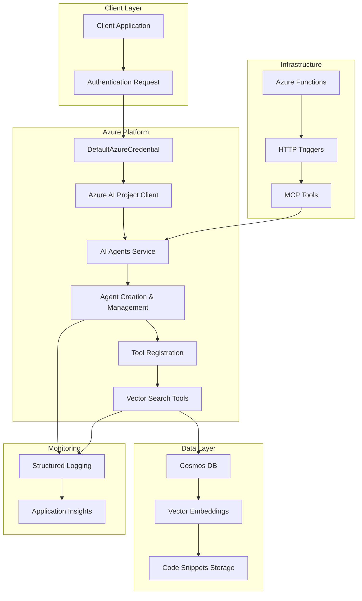
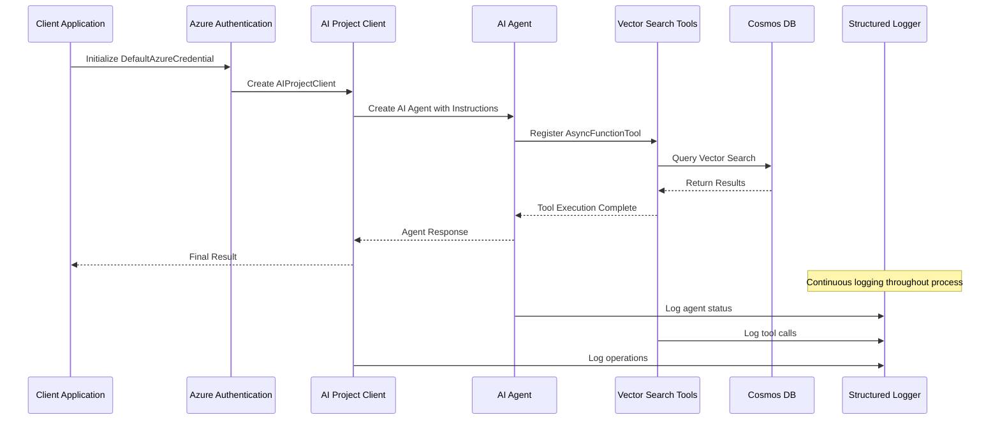

# DeepWiki Documentation - Comprehensive Snippet Analysis

## Project Overview

The Snippy project is a sophisticated code snippet management system that integrates Azure AI Agents services with Model Context Protocol (MCP) tools. It showcases advanced service usage patterns including authentication, project connection, and tool configuration. The project extensively leverages asynchronous programming, structured logging, and cloud infrastructure to provide a robust solution for code documentation, analysis, and intelligent retrieval.

## Major Concepts

### Azure AI Agents Service Integration Patterns

The project demonstrates how to integrate Azure AI services effectively through several key components:

- **Authentication**: Secure access to Azure services using `DefaultAzureCredential()` for proper authentication management
- **Project Connection**: Establishing connections to specific Azure AI projects using connection strings and credentials
- **Tool Configuration**: Setting up function tools like vector search for AI agents to enhance their capabilities
- **Agent Lifecycle Management**: Creating, configuring, and managing AI agents with specific personalities and instructions

### MCP Tools Integration

MCP tools automate operations related to code snippets using triggers that respond to Azure Function events. Tools such as `save_snippet`, `get_snippet`, `deep_wiki`, and `code_style` interact with various Azure services to provide intelligent code analysis and documentation generation.

### Async Context Management

The project demonstrates proper asynchronous programming patterns that allow non-blocking operations, improving application performance and responsiveness. Key aspects include:

- Proper use of `async with` context managers for resource cleanup
- Async credential management with Azure services
- Non-blocking AI agent operations and tool executions

### Structured Logging and Monitoring

Comprehensive logging provides insights into application behavior with structured formats that enable easier analysis, filtering, and visualization:

- Detailed parameter logging for debugging and transparency
- Status tracking for AI agent operations
- Error handling with proper exception logging and context

### Azure Functions Integration

Azure Functions provide the backbone for serverless execution, handling multiple types of triggers including HTTP and custom MCP triggers. The project leverages Azure Functions to perform backend operations with minimal infrastructure overhead.

### Cosmos DB & Vector Search

Cosmos DB is employed for document storage with vector search capabilities to enhance retrieval using embeddings generated by Azure OpenAI. This enables semantic search and intelligent code snippet discovery.

## Visual Diagrams

### Enhanced System Architecture



### AI Agent Workflow



## Comprehensive Snippet Catalog

| Snippet ID                 | Language | Purpose                                                      | Category              |
|----------------------------|----------|--------------------------------------------------------------|-----------------------|
| ai-agents-service-usage    | Python   | Azure AI Agents service integration with authentication     | Azure AI Integration  |
| snip-func                  | Python   | MCP tool trigger for saving snippets                        | MCP Tools            |
| func-app-snippy            | Python   | Azure Functions with multiple services integration          | Azure Functions      |
| main-bicep                 | Bicep    | Infrastructure as code for Azure provisioning               | Infrastructure       |
| test-snippet-default-project | Python | Simple print function demonstration                          | Basic Examples       |
| complex-snippet-default    | Python   | Basic Calculator class implementation                        | Class Examples       |

## Detailed Code Pattern Analysis

### Azure AI Agents Integration Pattern

The `ai-agents-service-usage` snippet demonstrates the canonical pattern for integrating with Azure AI Agents:

```python
# Pattern: Secure Authentication
async with DefaultAzureCredential() as credential:
    # Pattern: Project Connection
    async with AIProjectClient.from_connection_string(
        credential=credential,
        conn_str=os.environ["PROJECT_CONNECTION_STRING"]
    ) as project_client:
        # Pattern: Tool Registration
        functions = AsyncFunctionTool(functions=[vector_search.vector_search])
```

**Key Elements:**
- **Resource Management**: Proper use of async context managers ensures cleanup
- **Environment-Based Configuration**: Connection strings from environment variables
- **Tool Integration**: Function tools registered for agent capabilities

## Step-by-Step Walkthroughs

### Complete Azure AI Agent Implementation

1. **Authentication Setup**: 
   ```python
   async with DefaultAzureCredential() as credential:
   ```
   - Establishes secure Azure authentication
   - Handles credential lifecycle automatically

2. **Project Connection**:
   ```python
   async with AIProjectClient.from_connection_string(credential=credential, conn_str=os.environ["PROJECT_CONNECTION_STRING"]) as project_client:
   ```
   - Connects to specific Azure AI project
   - Uses environment-based configuration

3. **Tool Configuration**:
   ```python
   functions = AsyncFunctionTool(functions=[vector_search.vector_search])
   ```
   - Registers vector search capabilities
   - Enables intelligent code analysis

4. **Agent Creation and Management**:
   - Create agent with specific instructions and personality
   - Register tools for enhanced capabilities
   - Monitor execution and handle tool calls

### Saving and Managing Snippets

1. **Send HTTP Request**: Utilize Azure Function to POST a code snippet
2. **Generate Embeddings**: Azure OpenAI creates vector embeddings
3. **Store in CosmosDB**: Snippet and embeddings stored as documents
4. **Logging & Error Handling**: Comprehensive error tracking and user feedback

### Infrastructure Provisioning

1. **Define Configuration**: Use Bicep templates for resource specification
2. **Deploy Resources**: Execute Bicep scripts for Azure resource allocation
3. **Output Configuration**: Retrieve post-deployment configuration values

## Advanced Best Practices

### Security & Authentication
- **Secure Credential Management**: Always use `DefaultAzureCredential()` for Azure authentication
- **Environment-Based Configuration**: Store connection strings and secrets in environment variables
- **Resource Cleanup**: Use async context managers for proper resource disposal

### Asynchronous Operations
- **Non-Blocking Design**: Implement async patterns for improved performance
- **Proper Exception Handling**: Use try-catch blocks with detailed logging
- **Context Management**: Leverage `async with` for resource safety

### Logging & Monitoring
- **Structured Logging**: Use consistent logging formats with proper levels
- **Operation Tracking**: Log key operations with parameters and results
- **Error Context**: Include exception details and stack traces for debugging

### AI Agent Design
- **Clear Instructions**: Provide detailed system prompts for agent behavior
- **Tool Integration**: Register appropriate tools for agent capabilities
- **Status Monitoring**: Track agent execution status and handle failures

## Common Anti-Patterns to Avoid

### Security Issues
- **Hardcoded Credentials**: Never embed API keys or connection strings in code
- **Insufficient Authentication**: Always validate and refresh credentials properly
- **Unencrypted Secrets**: Use Azure Key Vault or environment variables for sensitive data

### Performance Problems
- **Blocking Operations**: Avoid synchronous calls in asynchronous environments
- **Resource Leaks**: Always use context managers for cleanup
- **Inefficient Logging**: Don't log sensitive data or create excessive log volumes

### Design Issues
- **Unstructured Logging**: Plain-text logs are difficult to parse and analyze
- **Poor Error Handling**: Generic exception handling without proper context
- **Tight Coupling**: Hard dependencies between components without proper abstraction

## Open Development TODOs

### Immediate Improvements
- Implement comprehensive error recovery mechanisms for AI agent failures
- Add retry logic with exponential backoff for Azure service calls
- Enhance logging with correlation IDs for distributed tracing

### Medium-Term Enhancements
- Expand vector search capabilities with advanced filtering and ranking
- Implement caching layers for frequently accessed snippets
- Add support for additional AI models and deployment options

### Long-Term Vision
- Multi-tenant support with isolated snippet collections
- Advanced analytics and usage patterns for snippet management
- Integration with additional cloud providers and AI services

## Technical References

### Azure Documentation
- [Azure AI Agents Documentation](https://docs.microsoft.com/en-us/azure/ai-services/agents/)
- [Azure Functions Documentation](https://docs.microsoft.com/en-us/azure/azure-functions/functions-reference)
- [Azure Identity Documentation](https://docs.microsoft.com/en-us/azure/active-directory/develop/msal-overview)

### Python & AsyncIO
- [Python AsyncIO Documentation](https://docs.python.org/3/library/asyncio.html)
- [Azure SDK for Python](https://docs.microsoft.com/en-us/azure/developer/python/)

### Infrastructure & Storage
- [Cosmos DB Documentation](https://docs.microsoft.com/en-us/azure/cosmos-db/introduction)
- [Azure Bicep Documentation](https://docs.microsoft.com/en-us/azure/azure-resource-manager/bicep)

### Monitoring & Logging
- [Structured Logging Best Practices](https://www.loggly.com/ultimate-guide/structured-logging/)
- [Azure Application Insights](https://docs.microsoft.com/en-us/azure/azure-monitor/app/app-insights-overview)

This comprehensive documentation provides detailed insights into the Snippy project's architecture, patterns, and best practices for Azure AI service integration.